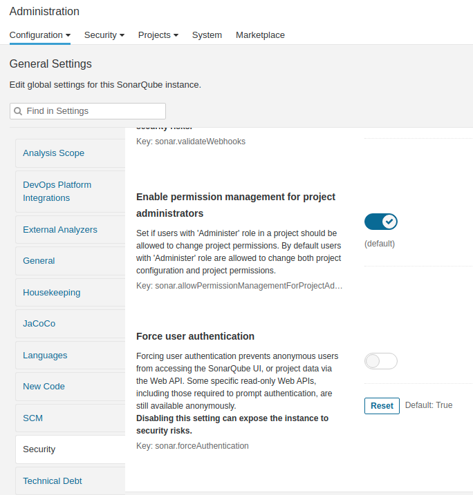

## Launch initial stack

You can run a initial stack using docker and docker compose.

With tha basic stack you going to deploy:
- **mysql** database
	- For this database the default values are:
	- user: root
	- pass: example

- **mysql admin interface**

- **sonarqube**
	- for sonarqube the default initial values are:
	- user: admin
	- pass: admin
> **Note**: Sonar is running with the default H2 database. If you want to use a persisted database, you have to include in this stack the required configuration.


### How to use it:

Deploy the stack with the following command

```sh
 docker-compose up --build -d
 # or
 docker-compose -p dev --build up -d
```

Remove / Destroy the stack

```sh
 docker-compose down
 # or
 docker-compose -p dev down
```

Start / Stop the stack

```sh
 docker-compose start
 docker-compose stop
 # or
 docker-compose -p dev start
 docker-compose -p dev stop
```

## Execute Sonar

### Disable Force User Authentication

> This is only for use in a local machine.


1. Go to sonar GUI [http://localhost:9000](http://localhost:9000)
2. Go to administration section
3. In security change the value of `Force user authentication` to false
4. Save changes



### Java

1. If you are using `mvn` and have been using the default stack that is in this repo. only need to execute or include the following command for each java app.

```sh
mvn sonar:sonar
```
> ***Note:*** If you are using a different sonar server or sonar cloud, you need to configure each project accordingly with your server or account.

_____________


## Angular App (demo-app)

This angular app was built according to the instructions in the following Angular [tutorial](https://angular.io/tutorial).

**Manual Run**:
1. Go to `demo-app` folder
2. Install all required dependencies
```sh
 npm install
```
3. Run the application.
```sh
 ng serve -o
```


> **Notes**:
> - To run this angular app, you would need angular 12 or greater.
> - This `demo-app` uses the API Rest that is located in `demo` folder.
